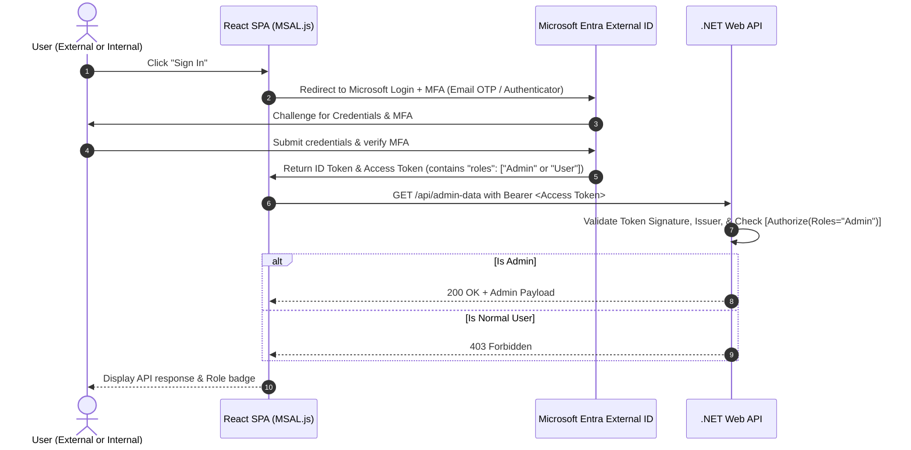

## 1. Identity Setup & Free-Tier Strategy (Dummy Users PoC)

Since you do not have an existing tenant or real users, we will use **100% free Microsoft services** without requiring any paid subscription:
- You will use a free Microsoft Account (personal `@outlook.com` / `@hotmail.com` or work account) to access the **Microsoft Entra admin center** (`https://entra.microsoft.com`).
- Microsoft provides a free tier for **Microsoft Entra ID / Microsoft Entra External ID** that includes tenant creation, app registrations, MFA, and user management for testing.
- We will create **two dummy users** directly in your tenant:
  1. `dummy-admin` (Assigned the **Admin** role)
  2. `dummy-user` (Assigned the **User** role)
- Both dummy accounts will go through the standard Microsoft MFA registration when they first sign in.

---

## 2. Role-Based Access Control (RBAC) Strategy

You require 2 roles: **Admin** and **User**.
- **Admin**: Has administrative permissions (e.g., access admin endpoints to manage users).
- **User**: Standard customer/external access (e.g., viewing customer account data).

We will implement this using **Entra App Roles** (emitted directly in the JWT `roles` claim) with backend enforcement in .NET:
```csharp
[Authorize(Roles = "Admin")]
[Authorize(Roles = "User,Admin")]
```
*(Optional backup: A lightweight DB-backed `IClaimsTransformation` in .NET if you prefer storing role assignments in a local SQL/staging database).*

---

## 3. High-Level Flow



---

## Proposed Changes & Guided Execution Steps

As requested, **you will execute all commands and code in your VS Code workspace**, while this assistant will guide you step-by-step with exact code, commands, and portal navigation.

### Phase 1: Microsoft Entra Configuration (Azure Portal)
We will walk you through setting up your free tenant and registrations:
1. **Create or switch to Microsoft Entra External ID Tenant**:
   - Ensure external tenant mode is active (50k free MAU).
2. **Configure Authentication & MFA**:
   - Enable Email OTP or Microsoft Authenticator under Authentication Methods.
3. **Register the Backend Web API (`hiviz-api`)**:
   - Expose an API scope (e.g., `api://<api-client-id>/access_as_user`).
   - Define App Roles in the Manifest / App Roles tab:
     - `Admin` (Value: `Admin`)
     - `User` (Value: `User`)
4. **Register the Frontend SPA (`hiviz-spa`)**:
   - Set Platform to **Single-Page Application (SPA)** with redirect URI: `http://localhost:5173`.
   - Grant permission to the exposed API scope `access_as_user`.
5. **Assign Roles**:
   - Assign test accounts to `Admin` and `User` roles under Enterprise Applications.

---

### Phase 2: .NET Web API Backend Setup (`./backend`)
You will create a lightweight ASP.NET Core Web API:
1. **Initialize Project**:
   ```bash
   dotnet new webapi -n HiViz.Api -f net8.0
   ```
2. **Install Security Packages**:
   ```bash
   dotnet add package Microsoft.AspNetCore.Authentication.JwtBearer
   dotnet add package Microsoft.Identity.Web
   ```
3. **Configure `appsettings.json`**:
   - Add `AzureAd` section with `Instance`, `TenantId`, `ClientId`, and `Audience`.
4. **Setup `Program.cs`**:
   - Add JWT Bearer authentication:
     ```csharp
     builder.Services.AddAuthentication(JwtBearerDefaults.AuthenticationScheme)
         .AddMicrosoftIdentityWebApi(builder.Configuration.GetSection("AzureAd"));
     builder.Services.AddAuthorization();
     ```
   - Configure CORS for `http://localhost:5173`.
5. **Create `AuthController.cs`**:
   - `GET /api/test/public`: No auth needed (`[AllowAnonymous]`).
   - `GET /api/test/user-data`: Accessible by `User` and `Admin` (`[Authorize(Roles = "User,Admin")]`).
   - `GET /api/test/admin-data`: Accessible only by `Admin` (`[Authorize(Roles = "Admin")]`).
   - `GET /api/test/me`: Returns token claims (roles, user object id, email, name).

---

### Phase 3: React SPA Frontend Setup (`./frontend`)
You will create a modern React SPA using Vite:
1. **Initialize Project**:
   ```bash
   npm create vite@latest frontend -- --template react
   cd frontend
   npm install @azure/msal-browser @azure/msal-react
   ```
2. **Configure MSAL (`authConfig.js`)**:
   - Set `clientId`, `authority` (pointing to your Entra External tenant), and API request scopes.
3. **Setup Root Provider (`main.jsx`)**:
   - Wrap the App with `<MsalProvider instance={msalInstance}>`.
4. **Build the Auth Test Interface (`App.jsx`)**:
   - **Login / Logout controls** using MSAL popup or redirect.
   - **Profile display**: Shows signed-in user name, email, and assigned role.
   - **MFA indicator**: Displays the authentication claims.
   - **Test Buttons**:
     - *Call Public Endpoint* (Expected: 200 OK)
     - *Call User Endpoint* (Expected: 200 OK for both User and Admin)
     - *Call Admin Endpoint* (Expected: 200 OK for Admin, 403 Forbidden for User)
   - Clean, visual feedback cards with status codes and role inspection.

---

## User Review Required

> [!IMPORTANT]
> **Microsoft Tenant Setup Choice**:
> Do you already have an Azure subscription / Microsoft Entra tenant, or do you need guidance on creating a new free Microsoft Entra External ID (CIAM) tenant from scratch?
>
> **MFA Preference**:
> For free built-in MFA, which method do you prefer to enforce for both internal and external users?
> 1. **Email One-Time Passcode (OTP)** (No mobile app needed, frictionless for external customers)
> 2. **Microsoft Authenticator App (TOTP/Push)** (Standard enterprise MFA)
> 3. **Both / User Choice**

---

## Verification Plan

### 1. Verification of Microsoft Authentication & MFA
- Start React app (`npm run dev`) at `http://localhost:5173`.
- Click "Sign In" -> Verify browser redirects to Microsoft login.
- Complete credentials -> Verify MFA challenge (Email OTP or Authenticator).
- Successful login displays user profile, email, and roles badge in the React UI.

### 2. Verification of Role-Based Authorization
- **As "User" Role**:
  - Call `/api/test/user-data` -> Expect **200 OK**.
  - Call `/api/test/admin-data` -> Expect **403 Forbidden** (access denied message in UI).
- **As "Admin" Role**:
  - Call `/api/test/user-data` -> Expect **200 OK**.
  - Call `/api/test/admin-data` -> Expect **200 OK** (admin payload displayed).
- **Unauthenticated**:
  - Call `/api/test/user-data` -> Expect **401 Unauthorized**.
